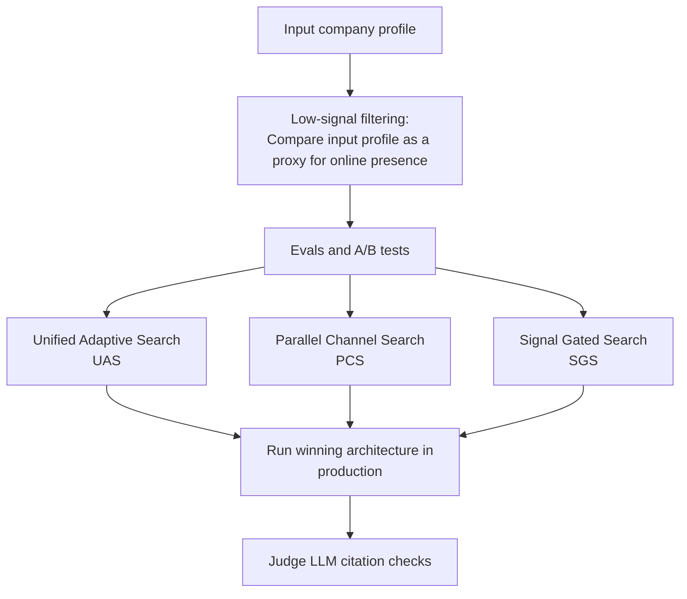
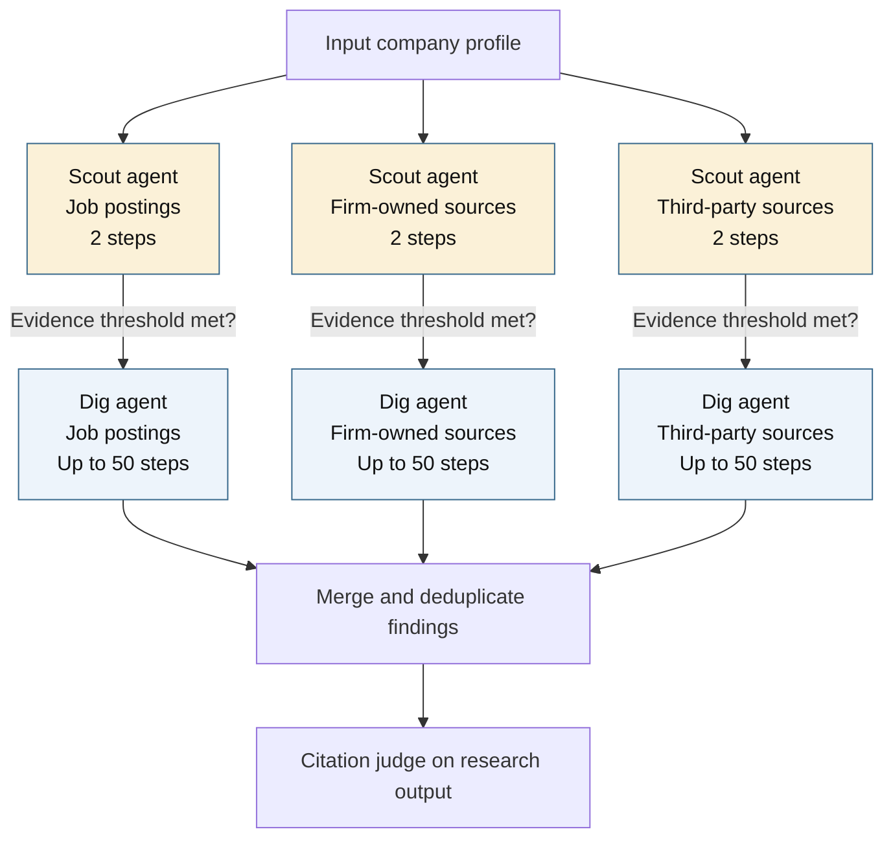

# AI adoption research

This repo is part of the paper: [*Prompted to Start: How Generative AI is Transforming Entrepreneurship*](https://papers.ssrn.com/sol3/papers.cfm?abstract_id=5749564)

Measuring a company’s internal AI adoption is difficult to measure from public sources. Aggregating this data across the economy is even harder. This project is a deep research harness specialized in producing economic datasets of enterprise AI adoption. It produced 30k+ findings from a sample of 44k startups, supporting research presented at NBER conferences. The harness combines public-information signal screening, specialized research agents, and independent citation verification. Three agentic architectures and an eval suite explore how to 1. Find sparsely documented evidence by applying steering guardrails. 2. Optimize deep research inference expenditure at scale.  3. Verify claims and identify hallucinations supported with logprob confidence

- [Production results](#production-results)
- [How it works](#how-it-works)
- [Multi-agent architecture](#multi-agent-architecture)
- [Citation verification agent](#citation-verification-agent)
- [How to use](#how-to-use)

## Production results

The search ran in August 2026 using the Signal Gated Search architecture.

| Output | Count |
| --- | --- |
| Starting sample | 44,387 U.S companies from crunchbase and pitchbook |
| After signal screening | 9,420 companies |
| Candidate ai-adoption evidence records | 30,062 |
| Verified findings | 95% with 98.4% average token prob confidence |
| Hallucinated findings | 3% with 97.5% average token prob confidence |

## How it works

## Multi-agent architecture

**Signal Gated Search (SGS)** is the production architecture. It separates research into three evidence channels: job postings, firm-owned sources, and third-party sources. Each channel gets a short scout followed by an optional full search, or dig.

Scouts assess whether the channel contains promising public material. They return a presence rating and URLs; code launches a dig only for moderate or strong material with at least one URL. The scout does not need to prove internal AI use. Each dig searches afresh from the company identity and assigned channel, without inheriting the scout’s links or snippets.

Scouts use web search only, preset `low`, and two steps. Digs use GPT-5.6 Luna through the Perplexity Agent API, search and page retrieval, up to 50 steps, `medium` search depth, and `high` reasoning effort. Findings are merged and deduplicated across channels. A company can receive zero to three digs.

The gate directs expensive searches toward researchable channels. Scouts still add overhead: when all three channels pass, SGS pays for three digs plus the screening calls.

**PCS and UAS simplify this orchestration:**

- **Parallel Channel Search** removes the scouts and runs one specialized agent per search path. This preserves explicit channel coverage but costs roughly 1.5x the inference in production, as search paths are always explored even if a screener would find unlikely to return findings.
- **Unified Adaptive Search** is the single-agent system alternative, removing channel specific subagents and model escalation mechanism. One model is given complete freedom in its search path and tool call iterations.

**Code:** `signal_gated_search/`, `parallel_channel_search/`, `unified_adaptive_search/`, `agent_api/client.py`, and `contracts/schema.py`.

## Citation verification agent

The verifier reopens each cited URL using Perplexity, with Tavily Extract and direct HTTP as retrieval fallbacks. A separate judge compares the saved claim with the retrieved page text, without new searches or outside knowledge. Supported claims receive `1`, unsupported claims receive `0`, and unreadable pages or technical failures remain unresolved.

**Code:** `citation_verification/` contains retrieval (`fetch.py`, `backup_fetch.py`), text processing (`text.py`), orchestration (`runner.py`), judging (`judge.py`), and log-probability confidence (`confidence.py`); `production/verify.py`

## How to use

| Command | What it does |
| --- | --- |
| `python -m production dry-run --limit 1` | Preview the research setup without API calls or output writes. |
| `python -m production run --limit 1` | Research one company and save candidate findings. |
| `python -m production status` | Show completed companies, remaining work, errors, and recorded spend. |
| `python -m production dedupe` | Remove repeated evidence from the saved findings. |
| `python -m production verify --limit 1 --live` | Reopen one citation and judge whether it supports the claim. Uses paid APIs. |
| `python -m citation_verification --findings path.jsonl` | Preview citation checks for a standalone findings file. Add `--live` to execute them. |
| `python -m evals run-benchmarks` | Benchmarks the 3 agent architectures on a sample of input companies. |
| `python -m evals run-tuning uas --stage screen --live` | Evaluate how different harness configs affect research yield and  cost. |
| `python -m evals run-verification` | Run citation agent evals. |
| `python -m evals open-dashboard` | Open evals dashboard. |

Use `--dataset path.jsonl` to choose company inputs. Select SGS, PCS, or UAS with `--architecture sgs|pcs|uas`; SGS is the default. `--limit N` bounds the batch.

Results live under `outputs/prod/<architecture>/`. The main tables are `findings.csv`, `findings_deduplicated.csv`, and `findings_verified.csv`.
